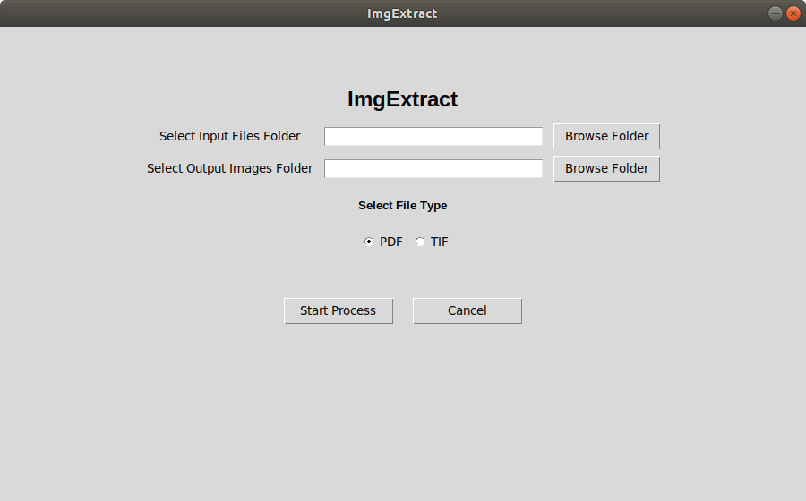

# imgextract 

[imgextract v0.0.1](https://pypi.org/project/imgextract/)

This python package can be used for extracting pages from PDF and TIF/TIFF files.


This packages uses poppler for reading pdf files, for windows platform it has been included in package but for linux we have to install it manually.

## How to get poppler

Download poppler from [poppler](https://poppler.freedesktop.org/)

Install poppler in linux [stackoverflow](https://stackoverflow.com/questions/32156047/how-to-install-poppler-in-ubuntu-15-04)

## How to use

### pdf page extraction

```python

from imgextract import ImgExtractor

if __name__ == "__main__":
    ss = ImgExtractor()
    # input files path, out put files path and file type
    ss.extract("/home/user/pdf_files", "/home/user/image_files", "pdf")


```

### tif/tiff image extraction

```python

from imgextract import ImgExtractor

if __name__ == "__main__":
    ss = ImgExtractor()
    # input files path, out put files path and file type
    ss.extract("/home/user/tif_files", "/home/user/image_files", "tif")


```

### GUI for Image extraction


[]


```python

from imggui import Creator

if __name__ == "__main__":
    ss = Creator()
    ss.openwindow()


```

### Installation

```shell
$ pip install imgextract
```

### License

  [MIT](LICENSE)